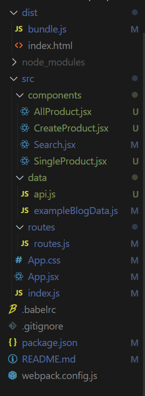
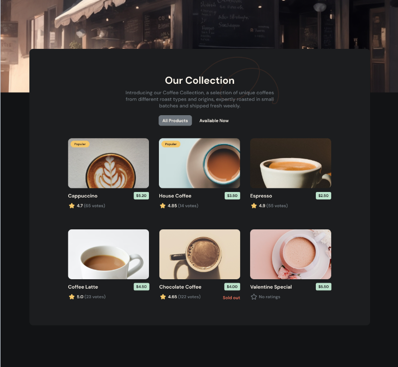
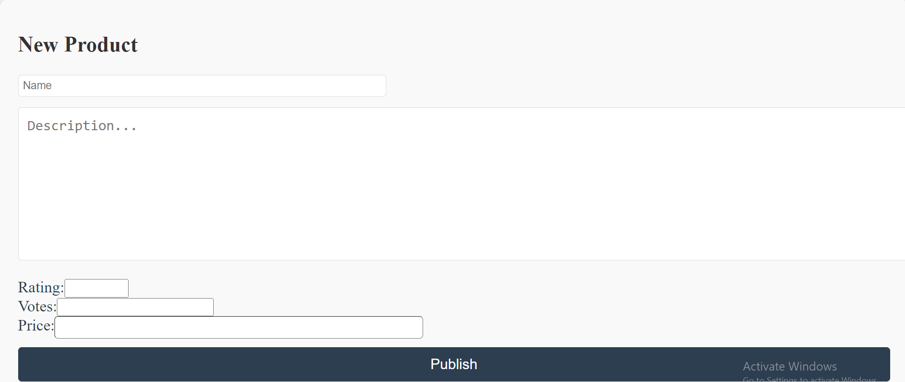

# OPEN PREVIEW.
# React Application : Coffee Shop App

#### This sprint will be your responsibility and your responsibility only so count on yourself  more to achieve a result almost similar to the original picture.

#### NOTES:
- [ ] This sprint is too similar to the previous one so make use of your knowledge and your resources to create a better application and work more on the design.
- [ ] Feel free to show off your designing skills to create this application.
- [ ] You will feel that the files are not that different from the previous ones therefore you can add and modify your components whenever you feel it's a must.
- [ ] You might find some missing files and packages, that is your job to fill the missing pieces of the puzzle to create a well organized and designed application.

#### Try to use a background image such as this one to start your application. 
  

 #### JSX and ES6 Syntax

JSX is a syntax extension to JavaScript. Used with React to describe what the UI should look like. JSX may remind you of a template language, but it comes with the full power of JavaScript.

JSX produces React “elements”. We will explore rendering them to the DOM in the next section. [Here](https://react.dev/learn/writing-markup-with-jsx), you can find the basics of JSX necessary to get you started.

ES6 is full of surprises check these two amazing cheat sheets
[here](https://devhints.io/es6) to learm more about, destructuring,
ES6 modules and other feautres of ES6.

#### Transpilers and code bundlers

The browser does not understand JSX syntax, therefore we need a transpiler like [Babel](https://babeljs.io/).
We also may use a lot of assets especially in front end development like CSS, SASS, fonts and images... and therefore we need a code bundler like [webpack](https://webpack.js.org/).  
For this sprint you don't have to worry about configuring babel and webpack, but you can check `webpack.config.js` and `.babelrc` files to have an idea about such configurations.

#### Think in React 

You will need to start [thinking in React](https://react.dev/learn/thinking-in-react)

### Your Project

Install your dependecies using `npm install` check your scripts in `package.json ` then run your app and open the `dist/index.html` file with Live Server

#### Folder Structure

#### check the folder structure

  

####   Objective:
Build a web application that fetches data from the provided external server API 
(https://api.sampleapis.com/coffee/hot), stores it in your own database, and allows users to perform CRUD operations on the data.

###   Setup External API:

Use the provided API URL (https://api.sampleapis.com/coffee/hot) to fetch coffee-related data.

### Backend Development:

Set up an Express.js server.
Use the controller folder to handle data fetching and CRUD operations.
Implement routes in the routes folder to connect API endpoints to the corresponding controller functions.

#### Database Design:

Design a MongoDB/mysql database schema to store the fetched coffee-related data. Include necessary collections and document structures.

###  Frontend Development:
#### 1- SingleProduct 
SingleProduct is a simple `function` component that displays one prrduct containing:
  
- The product name.
- The Product Rating.
- The Product Description.
- The Product availability.
- The Product Popularity.
- The product Votes

#### 2- AllProduct 
AllProduct is a `function` component which is supposed to map over a collection of product data taken as a `props`.

You can  modify your components in any way you feel it's more helpful.

   

#### 3- CreateProduct 
CreateProduct is a `function` component Should have inputs that enable the user to post products.

   

#### 4- Search 
Search is a `function` component that contains inputs to enable the user to search for a product.    
 

  
### Basic Requirements

- [ ] Check your `src/index.js`, render the `App` component to the DOM and explore the codebase to get an understanding of each component's responsibility.
      Hint: take a look at React docs and take your baby steps to learn the basic concepts [React docs](https://react.dev/learn) ;

- [ ] Use your dummy data `src/data/exampleProductsData.js` to render your `AllProduct`.

- [ ] Make your application render `SingleProduct` whenever the user clicks on the product's name

- [ ] Check your conditional rendreing mechanism, and update it so it can render a `CreateProduct` component when a user clicks on the create post button.  
**NOTE**: `CreateProduct` is a `function` component using the [useState](https://react.dev/reference/react/useState) Hook from React to be able to use state without writing a class

### Advanced

- [ ] Make your app interacts with the products API and modify what you need to change for each product according to that API's data.
 
- [ ] Implement a live `Search` feauture in your Coffee Shop app, and make use of [react component life cycle](https://reactjs.org/docs/state-and-lifecycle.html), so your app can intiate with data

- [ ] You have some starter code for [react router](https://reactrouter.com/en/main/start/tutorial) refactor your app and replace conditional rendering with it.

- [ ] Refactor your application to [Redux](https://redux.js.org/)
